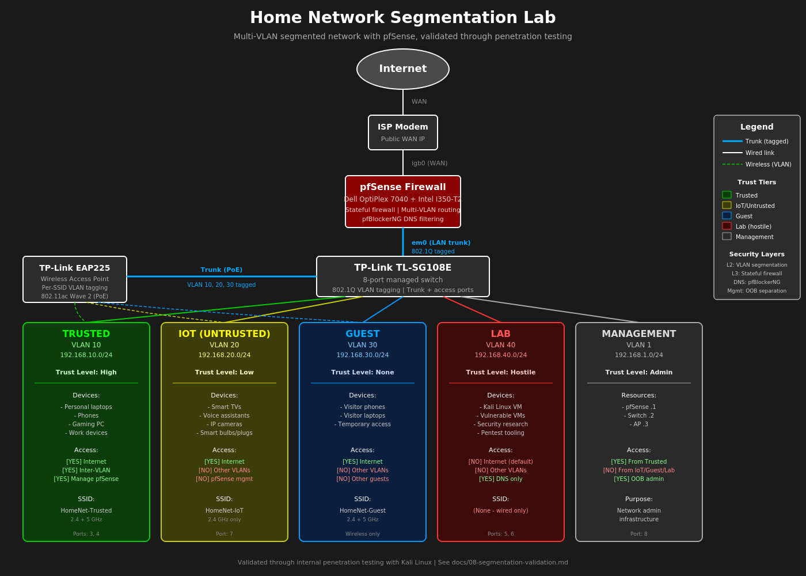

# Design and Architecture

The reasoning behind the network's design — trust tiers, VLAN strategy, IP planning, and the security model.

## Design Goals

This network was designed with three primary goals:

1. **Demonstrate enterprise-grade segmentation** in a home environment using standard tools and patterns.
2. **Implement defense in depth** — no single security control as the sole protection.
3. **Validate security claims** through testing, not just configuration.

## Trust Tier Model

Devices and traffic are grouped into four trust tiers based on the level of access they should have to other resources.

### Tier 1: Trusted (VLAN 10)

Personal devices owned and controlled by the user — laptops, phones, work computers. These are well-managed, kept up to date, and assumed (within reason) to be uncompromised.

- Full internet access
- Permitted to initiate connections to other VLANs
- Can manage pfSense (with optional restriction to admin host)

### Tier 2: IoT (VLAN 20)

Untrusted devices that need internet access — smart TVs, voice assistants, IP cameras, smart bulbs, appliances. These are devices with poor security track records, infrequent updates, and constant cloud connectivity.

- Internet access permitted
- Cannot initiate connections to any other private network
- Cannot reach pfSense management interfaces
- DNS-layer threat filtering applied

### Tier 3: Guest (VLAN 30)

Visitor devices. No knowledge of these devices' security posture. Treated as completely untrusted.

- Internet access only
- Fully isolated from all internal resources
- AP-level client isolation (guests cannot see each other)

### Tier 4: Lab (VLAN 40)

Hostile zone for security research, vulnerable VMs, and pentest tooling. Default-deny policy with explicit allowances added when needed.

- No internet access by default (Reject rule for fast-fail)
- Cannot reach any other VLAN
- Cannot reach pfSense management
- DNS allowed for VM functionality

## Why Four VLANs

The VLAN count balances three considerations:

- **Too few VLANs** (1-2) — provides no meaningful segmentation
- **Too many VLANs** (10+) — adds complexity without clear security benefit at home scale
- **Four VLANs** — covers the four meaningful trust categories without unnecessary complexity

This matches typical small-business segmentation patterns.

## IP Address Planning

### Why RFC 1918

All internal subnets use RFC 1918 private address space, which is reserved by IETF for internal use and never routable on the public internet.

### Why 192.168.x.x

The 192.168.0.0/16 block was chosen over 10.0.0.0/8 or 172.16.0.0/12 for these reasons:

- **Convention** — home networks typically use this range, easily recognized
- **Right-sized** — 65,536 addresses is plenty for any home setup
- **Mental mapping** — third octet aligned with VLAN ID for instant readability

### Subnet Map

| VLAN ID | Subnet | Pattern |
|---------|--------|---------|
| 10 | 192.168.10.0/24 | Third octet matches VLAN |
| 20 | 192.168.20.0/24 | Third octet matches VLAN |
| 30 | 192.168.30.0/24 | Third octet matches VLAN |
| 40 | 192.168.40.0/24 | Third octet matches VLAN |

When reading firewall logs, an IP like 192.168.20.137 is instantly recognizable as IoT VLAN — no lookup required.

### Why /24 for Each VLAN

A /24 subnet provides 254 usable host addresses per VLAN — vastly more than needed at home scale. Benefits:

- **Easy mental math** — last octet is purely the host portion
- **Room to grow** — IoT device counts only increase over time
- **Consistent design** — every VLAN structured identically reduces cognitive load
- **Standard convention** — matches every networking tutorial

In a corporate environment, subnets would be sized more carefully (point-to-point links get /30, server VLANs might get /27). At home scale, uniform /24 is appropriate.

### Avoiding Common ISP Defaults

192.168.0.0/24 and 192.168.1.0/24 are common ISP router defaults. The home lab uses .1.x for the management VLAN (consistent with pfSense default) and unique subnets per VLAN otherwise, reducing conflict risk if VPN or remote access is added later.

## Security Model: Defense in Depth

No single security control protects the network. Multiple layers operate independently.

| Layer | Control | Purpose |
|-------|---------|---------|
| Layer 2 | 802.1Q VLAN segmentation | Broadcast domain isolation |
| Layer 3 | Subnet separation | Forces inter-VLAN traffic through router |
| Layer 4-7 | Stateful firewall | Per-VLAN policy enforcement |
| Application | DNS-layer filtering | Block known-bad domain resolution |
| Wireless | Per-SSID VLAN tagging | Wireless devices auto-segmented |
| Operational | Management plane separation | Admin access requires deliberate action |

If any single layer fails or is bypassed, the others remain active. An attacker would need to defeat each independently.

## Architecture Diagram

## Threat Model

This design specifically addresses these realistic threats:

- **Compromised IoT device** — segmented into IoT VLAN, cannot pivot to Trusted resources
- **Guest with malicious intent** — fully isolated, internet only
- **Lateral movement attempt** — stateful firewall blocks cross-VLAN reconnaissance
- **DNS-based malware C2** — filtered at the DNS layer
- **Wireless eavesdropper** — separate SSIDs and passwords per trust tier

Threats explicitly NOT addressed (out of scope for home network):

- Targeted nation-state attacks
- Physical access to devices
- Compromise of the pfSense firewall itself
- Supply chain attacks on hardware